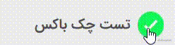

# jb-checkbox

[](https://www.webcomponents.org/element/jb-checkbox)
[](https://raw.githubusercontent.com/javadbat/jb-checkbox/main/LICENSE)
[](https://www.npmjs.com/package/jb-checkbox)


Checkbox web component with smooth check animation.

- Customizable UI with CSS variables and CSS parts.
- Form-associated checkbox value.
- Built-in required and external error validation.
- Custom validation through `jb-validation`.



## When to use

Use `jb-checkbox` for a single boolean option that needs JB Design System styling, validation, form association, disabled state, or custom label markup.

For multiple related choices, render a list of `jb-checkbox` elements with different `name` or `value` handling based on your form model.

## Demo

- [Storybook](https://javadbat.github.io/design-system/?path=/docs/components-form-elements-jbcheckbox)

## Using With JS Frameworks

<a href="https://github.com/javadbat/jb-checkbox/tree/main/react" target="_blank" rel="noopener noreferrer"></a>

Other integrations: <a href="https://javadbat.github.io/design-system/?path=/docs/getting-started-framework-integration--docs#angular" target="_blank" rel="noopener noreferrer">Angular</a> · <a href="https://javadbat.github.io/design-system/?path=/docs/getting-started-framework-integration--docs#vue" target="_blank" rel="noopener noreferrer">Vue</a> · <a href="https://javadbat.github.io/design-system/?path=/docs/getting-started-framework-integration--docs#nuxt" target="_blank" rel="noopener noreferrer">Nuxt</a> · <a href="https://javadbat.github.io/design-system/?path=/docs/getting-started-framework-integration--docs#svelte" target="_blank" rel="noopener noreferrer">Svelte</a> · <a href="https://javadbat.github.io/design-system/?path=/docs/getting-started-framework-integration--docs#sveltekit" target="_blank" rel="noopener noreferrer">SvelteKit</a> · <a href="https://javadbat.github.io/design-system/?path=/docs/getting-started-framework-integration--docs#solidjs" target="_blank" rel="noopener noreferrer">SolidJS</a> · <a href="https://javadbat.github.io/design-system/?path=/docs/getting-started-framework-integration--docs#lit" target="_blank" rel="noopener noreferrer">Lit</a> · <a href="https://javadbat.github.io/design-system/?path=/docs/getting-started-framework-integration--docs#nextjs" target="_blank" rel="noopener noreferrer">Next.js</a> · <a href="https://javadbat.github.io/design-system/?path=/docs/getting-started-framework-integration--docs#astro" target="_blank" rel="noopener noreferrer">Astro</a> · <a href="https://javadbat.github.io/design-system/?path=/docs/getting-started-framework-integration--docs#blazor" target="_blank" rel="noopener noreferrer">Blazor</a> · <a href="https://javadbat.github.io/design-system/?path=/docs/getting-started-framework-integration--docs#server-rendered-templates" target="_blank" rel="noopener noreferrer">Server-rendered templates</a> · <a href="https://javadbat.github.io/design-system/?path=/docs/getting-started-framework-integration--docs#wordpress" target="_blank" rel="noopener noreferrer">WordPress</a> · <a href="https://javadbat.github.io/design-system/?path=/docs/getting-started-framework-integration--docs#alpinejs-and-htmx" target="_blank" rel="noopener noreferrer">Alpine.js and HTMX</a>

## Installation

```sh
npm i jb-checkbox
```

```js
import 'jb-checkbox';
```

```html
<jb-checkbox label="Accept terms"></jb-checkbox>
```

Use the label slot when the label needs custom markup:

```html
<jb-checkbox>
  <span slot="label">Accept <a href="/terms">terms</a></span>
</jb-checkbox>
```

## API reference

### Attributes

| name | type | default | description |
| --- | --- | --- | --- |
| `value` | `boolean` | `false` | Initial checked value attribute. Use `value="true"` for checked markup; omit the attribute or use the boolean `value` property for false/programmatic updates. |
| `label` | `string` | `""` | Text label. Use `slot="label"` for custom markup. |
| `message` | `string` | `""` | Helper text shown below the label when no validation error is visible. |
| `name` | `string` | `""` | Form field name. |
| `disabled` | `boolean` | `false` | Disables user toggling and sets the `disabled` custom state. |
| `required` | `boolean \| string` | `false` | Enables required validation. A string value is used as the required error message. |
| `error` | `string` | `""` | External validation error message used as a custom error. |
| `size` | `'xs' \| 'sm' \| 'md' \| 'lg' \| 'xl'` | `md` style defaults | Visual size variant. |

### Properties

| name | type | readonly | description |
| --- | --- | --- | --- |
| `value` | `boolean` | no | Boolean checked value. The native form value is set to `"true"` or `"false"`. |
| `checked` | `boolean` | yes | `true` when `value` is `true`. |
| `disabled` | `boolean` | no | Disables user toggling and updates accessibility/custom state. |
| `required` | `boolean` | no | Enables required validation. |
| `validation` | `ValidationHelper<boolean>` | yes | Validation helper from `jb-validation`; set `validation.list` for custom rules. |
| `name` | `string` | yes | Current `name` attribute value. |
| `initialValue` | `boolean` | no | Baseline value used by `isDirty`. |
| `isDirty` | `boolean` | yes | `true` when current `value` differs from `initialValue`. |
| `isAutoValidationDisabled` | `boolean` | no | Compatibility flag for form input standards. |
| `validationMessage` | `string` | yes | Current native validation message from `ElementInternals`. |

### Methods

| name | returns | description |
| --- | --- | --- |
| `checkValidity()` | `boolean` | Runs validation without showing the error message. |
| `reportValidity()` | `boolean` | Runs validation and shows the first error message. |
| `focus(options?)` | `void` | Focuses the checkbox control when it is not disabled. |

### Events

| event | detail | description |
| --- | --- | --- |
| `before-change` | none | Cancelable event dispatched before toggling. During this event, `event.target.value` exposes the next value. |
| `change` | none | Cancelable event dispatched after value changes. Prevent default to revert the toggle. |
| `load` | none | Dispatched from `connectedCallback` before `initProp`. |
| `init` | none | Dispatched from `connectedCallback` after `initProp`. |

## Get and set value

Use the `value` property for controlled updates.

```js
const checkbox = document.querySelector('jb-checkbox');

checkbox.value = true;
console.log(checkbox.checked); // true
```

```js
checkbox.addEventListener('change', (event) => {
  console.log(event.target.value);
});
```

## Disable checkbox

```js
document.querySelector('jb-checkbox').disabled = true;
```

```html
<jb-checkbox disabled></jb-checkbox>
```

## Validation

`jb-checkbox` uses [`jb-validation`](https://github.com/javadbat/jb-validation). Built-in validation covers `required` and `error`; custom validations can be added with `validation.list`.

```js
const checkbox = document.querySelector('jb-checkbox');

checkbox.validation.list = [
  {
    validator: (value) => value === true,
    message: 'You must check this before continuing',
  },
];

const isValid = checkbox.reportValidity();
```

### Required Validation

```html
<jb-checkbox required label="Accept terms"></jb-checkbox>
<jb-checkbox required="Please accept terms" label="Accept terms"></jb-checkbox>
```

### External error

Set the `error` attribute when an external validation system owns the error state.

```html
<jb-checkbox error="Please accept terms" label="Accept terms"></jb-checkbox>
```

## Sizes

```html
<jb-checkbox size="sm" label="Small checkbox"></jb-checkbox>
```

Supported size values are `xs`, `sm`, `md`, `lg`, and `xl`.

## Slots

| slot | description |
| --- | --- |
| `label` | Custom label content rendered next to the checkbox. |

## CSS parts and states

| part | description |
| --- | --- |
| `checkbox` | The checkbox SVG element. |
| `check-bg` | The checkbox background rectangle. |
| `check-mark` | The animated check mark path. |
| `label` | The label slot. |
| `message` | The helper or validation message. |

| custom state | description |
| --- | --- |
| `checked` | Applied when `value` is true. |
| `disabled` | Applied when `disabled` is true. |
| `invalid` | Applied while a validation error is visible. |

```css
jb-checkbox::part(label) {
  font-weight: 600;
}

jb-checkbox:state(checked)::part(label) {
  color: var(--jb-text-primary);
}

jb-checkbox:state(invalid)::part(message) {
  font-weight: 600;
}
```

## Custom style

For complete styling guidance, live examples, CSS parts, custom states, variables, and copyable style recipes, see [Styling](https://javadbat.github.io/design-system/?path=/docs/components-form-elements-jbcheckbox-styling).

## Accessibility notes

- The component uses `ElementInternals.role = "checkbox"` where supported.
- The `label` attribute is exposed as `ariaLabel`.
- `ariaChecked` is synchronized with the current checked value.
- `disabled`, `checked`, and `invalid` states are synchronized with `ElementInternals` custom states where supported.
- The `form` property returns the associated form from `ElementInternals`.
- The shadow root uses `delegatesFocus`; calling `focus()` focuses the internal checkbox wrapper when the component is not disabled.
- Pressing Space toggles the checkbox when it is focused and not disabled.
- Disabled checkboxes are removed from the internal tab order.
- The component is form-associated and sets its form value to the string `"true"` or `"false"`.

## Related Docs

- See [`jb-checkbox/react`](https://github.com/javadbat/jb-checkbox/tree/main/react) if you want to use this component in React.
- See [All JB Design System Component List](https://javadbat.github.io/design-system/) for more components.
- Use [Contribution Guide](https://github.com/javadbat/design-system/blob/main/docs/contribution-guide.md) if you want to contribute to this component.

## AI agent notes

- Import `jb-checkbox` once before using `<jb-checkbox>`.
- Use the boolean `value` property for controlled state. Avoid relying on `value="false"` as an HTML attribute.
- Read `event.target.value` in `before-change` for the next value and in `change` for the committed value.
- Use `required`, `error`, and `validation.list` for validation.
- Use `slot="label"` for custom label markup.
- Style with CSS variables, `::part(...)`, and `:state(checked|disabled|invalid)`.
- This package includes [`custom-elements.json`](./custom-elements.json) and points to it with the package.json `customElements` field. The field is documented by the Custom Elements Manifest project in [Referencing manifests from npm packages](https://github.com/webcomponents/custom-elements-manifest#referencing-manifests-from-npm-packages).
- In `custom-elements.json`, `exports.kind: "js"` describes the JavaScript/TypeScript class export and `exports.kind: "custom-element-definition"` maps the `jb-checkbox` tag name to that class.
